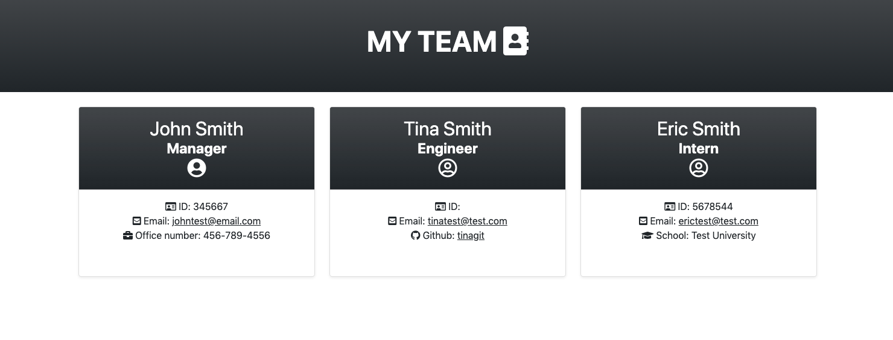

# Team-Profile-Generator
## Overview
For this assignment we were tasked into creating an easy to use team profile generator. In this generator users will put in their managers information which includes name, id, email and office number. They will be then given the option to add employees in which they will be able to put in name , email , id and depending if they are engineers or interns they will be able to place either github link or provide school information.




## Acceptance Criteria
```
GIVEN a command-line application that accepts user input
WHEN I am prompted for my team members and their information
THEN an HTML file is generated that displays a nicely formatted team roster based on user input
WHEN I click on an email address in the HTML
THEN my default email program opens and populates the TO field of the email with the address
WHEN I click on the GitHub username
THEN that GitHub profile opens in a new tab
WHEN I start the application
THEN I am prompted to enter the team manager’s name, employee ID, email address, and office number
WHEN I enter the team manager’s name, employee ID, email address, and office number
THEN I am presented with a menu with the option to add an engineer or an intern or to finish building my team
WHEN I select the engineer option
THEN I am prompted to enter the engineer’s name, ID, email, and GitHub username, and I am taken back to the menu
WHEN I select the intern option
THEN I am prompted to enter the intern’s name, ID, email, and school, and I am taken back to the menu
WHEN I decide to finish building my team
THEN I exit the application, and the HTML is generated
```

## Learning

With this assignment I was able to practice my javascript even further. I was able to learn classes and also learning how to keep things more organized so that I can trouble shoot quicker.

## Links
[Team profile Generator Demo](https://drive.google.com/file/d/186UDMbt9aOfODAN6lOISRo_k41qCVE-w/view)

[Github repository](https://github.com/imoranmo/Team-Profile-Generator)